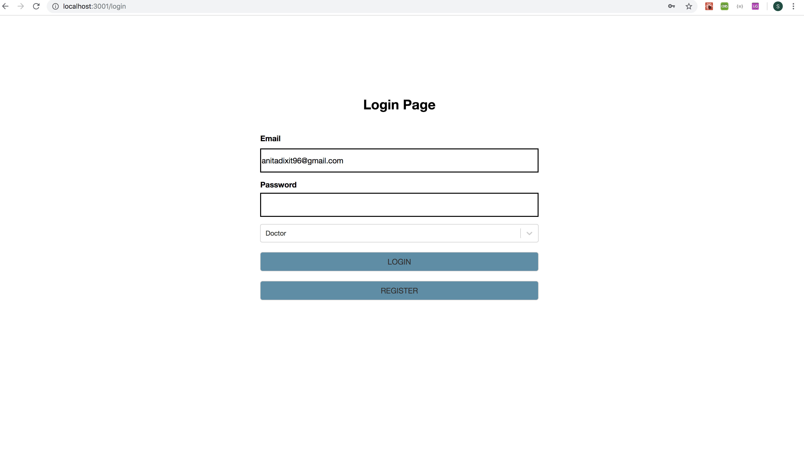

# Challenge-FrontEnd
The project is a front-end implementation of the challenge.

## Setup and Run

* Have npm installed
  
## Development Starting Point and Framework

* Frontend (ReactJS, CSS, Styled Components)
  
* Backend (Express Server, NodeJS, MongoDB )
  

### Implemented Parts

I have implemented the following three views for application:
#### Doctor View
 - View Appointments
 - Prescribe Medication
 - Prescribed Medication
 #### Patient View
 - Book Appointments
 - View Prescribed Medication
 #### Admin View
 - Delete Doctors from system
 - Edit Patient Info(Under Construction)
 
 #### Other screens in the application are:
 - Login Page
 - Registeration Page

### Login Screen

### Registeration Page

### Doctor's View - View Appointments

### Doctor's View - Prescribe Medication
*Select a record and then click Prescribe Drugs Button to get on this page

### Doctor's View - Already Prescribed Medication

### Patient's View - Book Appointment

  

### Patient's View - View Medication

  

### Admin View - Delete Doctor
* Once the doctor is deleted from the system, that doctor can no longer access the system and also no patient can book appointments with that doctor.

  

### Project Structure
  
    ├── src
    |------components
    |------------Button
    |------------InputField
    |------------LightBox
    |------------Tabs
    |------config
    |------utils
    |------------API
    |------------GlobalState
    |------------Router
    |-------Views
    |-------------Admin
    |-------------Doctor
    |-------------Patient
    |-------------Login
    |-------------Register
    ├── package.json
    

